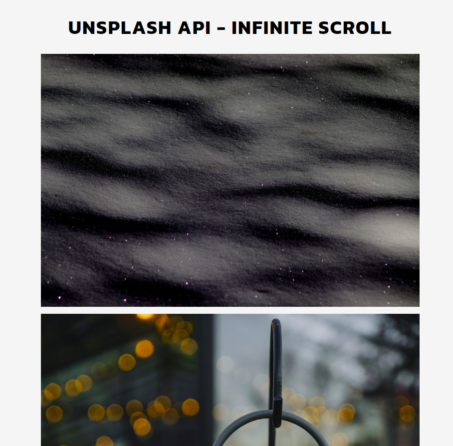

# Infinite Scroll - A DOM manipulation exercise

This is an exercise in DOM manipulation that I did following a tutorial.

## Table of contents

- [Screenshot](#screenshot)
- [Links](#links)
- [My process](#my-process)
  - [Built with](#built-with)
  - [Useful resources](#useful-resources)
- [Author](#author)

### Screenshot

### Links

- Solution URL: [click here](https://github.com/climaco-sarmiento/infinite-scroll)
- Live Site URL: [click here](https://climaco-sarmiento.github.io/infinite-scroll/)

## My process

### Built with

- Semantic HTML5 markup
- CSS custom properties
- Javascript

### Useful resources

- [Unsplash API used for loading images](https://unsplash.com/documentation) - Excellent resource for developers regarding images.

## Author

- Website - [Ubaid Khalid](https://www.ubaidkhalid.dev)
- LinkedIn - [Ubaid Khalid](https://www.linkedin.com/in/ubaid-khalid-dev/)
